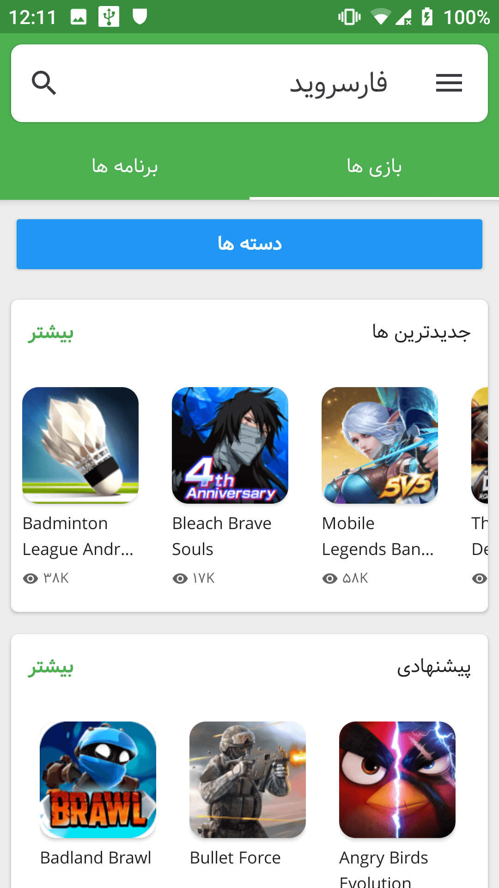
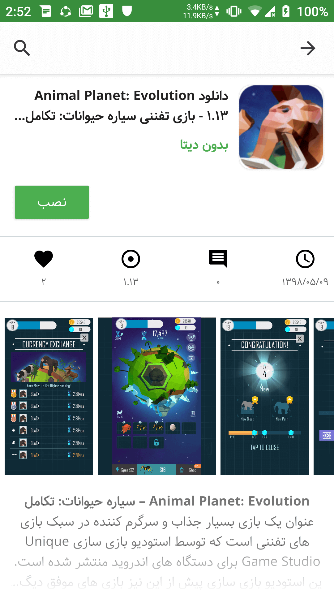
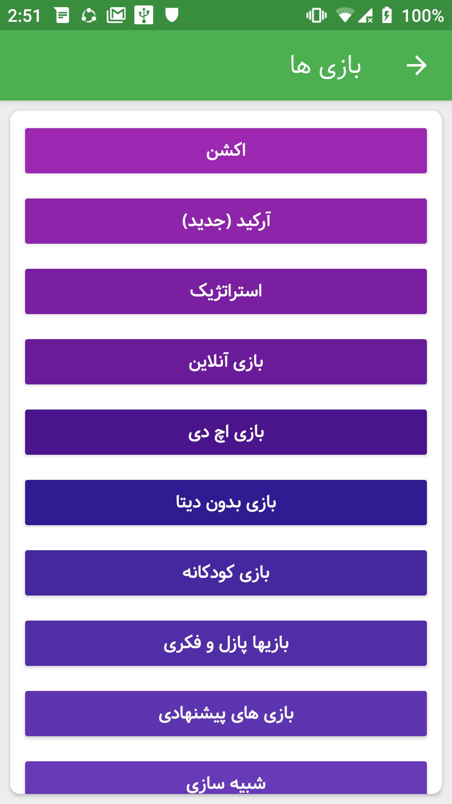
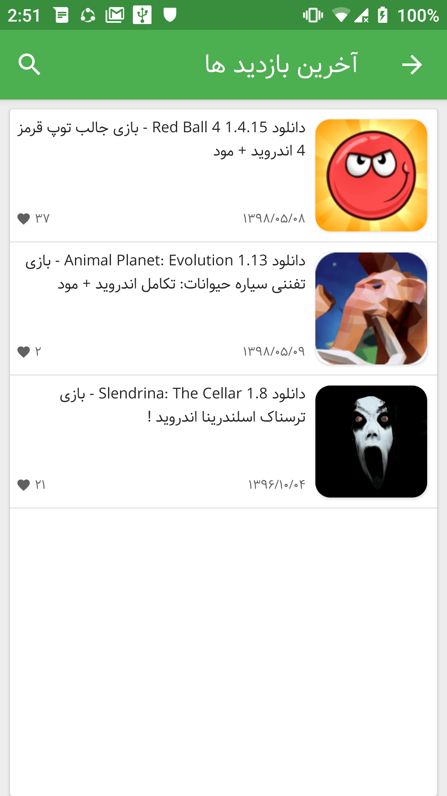

   <h1 style="text-align: center">اپ فارسروید</h1>

    

   <h1>
      فارسروید چیست؟
   </h1>

   

      فارسروید یک منبع برای دانلود بازی ها و برنامه های اندروید است.
   

   <h1>
      این برنامه چکار میکند؟
   </h1>

   

      این اپلیکیشن اندروید، برای سایت فارسروید
      طراحی شده است تا بر روی دستگاه های اندرویدی خود دسترسی راحت تری به این سایت داشته باشید.
   

   <h1>
      تصاویر
   </h1>

   
   
   
   

   <h1>
      دانلود اپ
   </h1>

   <a href="https://shahab-yousefi.github.io/farsroid/">
      صفحه دانلود اپ
   </a>

   

      این برنامه کاملآ غیر رسمی بوده و هیچ ارتباطی با اعضای سایت فارسروید ندارد.
   

